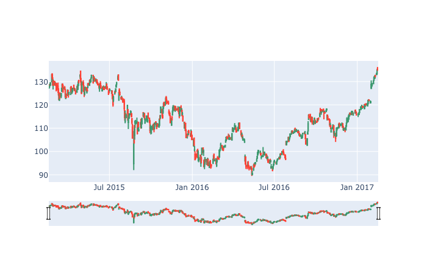

# econophysics
My codes over the econophysics course based on python, numpy and pandas

## Requirement
To work with csv files

`
pip install pandas
`

To download stock prices from internet

`
pip install pandas-datareader
`

For the plotting part.

`
pip install matplotlib
`
# moving average method

